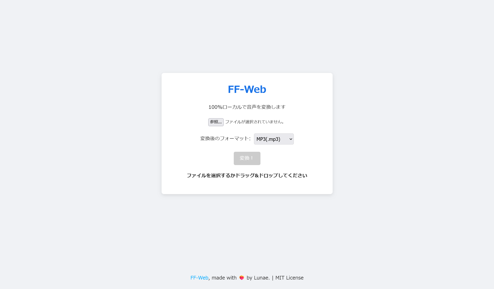

# FF-Web

<p align="center">
  
</p>

<p align="center">
  A simple, 100% browser-based audio converter.
</p>

## ✨ 概要 (Overview)

FF-Webは、[ffmpeg.wasm](https://github.com/ffmpegwasm/ffmpeg.wasm) を利用した完全にブラウザ上で動作する音声ファイルコンバーターです。
サーバーにファイルをアップロードする必要がなく、**すべての変換処理はあなたのPC内で完結します。** そのため、プライバシーを気にすることなく安全に利用できます。

## 🚀 特徴 (Features)

-   **クライアントサイド処理**: ファイルが外部サーバーに送信されることはありません。
-   **多彩なフォーマット**: MP3, AAC(m4a), FLAC, WAV, Opus形式への変換をサポート。
-   **ドラッグ＆ドロップ**: ファイルを画面に直接ドラッグ＆ドロップして簡単に追加できます。
-   **サーバー不要**: 一度ページを読み込めば、オフラインでも動作します。

## 🛠️ ローカルでの実行方法 (Usage)

このアプリケーションをローカルで実行するには、特定のHTTPヘッダを送信できるWebサーバーが必要です。ここでは **Docker** を使った簡単な実行方法を説明します。

### 前提条件

-   [Docker](https://www.docker.com/products/docker-desktop/) および Docker Compose がインストールされていること。

### 手順

1.  **ファイル構成**
    まず、プロジェクトを以下のディレクトリ構成で配置します。

    ```
    ff-web/
    ├── README.md
    ├── compose.yaml
    ├── index.html
    ├── style.css
    ├── script.js
    ├── coi-serviceworker.min.js
    └── nginx/
        └── default.conf
    ```

2.  **Nginx 設定ファイルの作成**
    `nginx` フォルダ内に `default.conf` を作成し、以下の内容を記述します。これは `ffmpeg.wasm` の動作に必要なHTTPヘッダーを追加するための設定です。

    ```nginx
    server {
        listen 80;
        server_name localhost;

        root /usr/share/nginx/html;
        index index.html;

        location / {
            try_files $uri $uri/ =404;

            # ffmpeg.wasm を動作させるために必要なヘッダー
            add_header Cross-Origin-Opener-Policy "same-origin" always;
            add_header Cross-Origin-Embedder-Policy "require-corp" always;
        }
    }
    ```

3.  **Docker Compose ファイルの作成**
    プロジェクトのルートに `compose.yaml` を作成します。

    ```yaml
    version: '3.8'

    services:
      web:
        image: nginx:1.29-alpine
        container_name: ff-web-server
        ports:
          - "8080:80"
        volumes:
          - ./index.html:/usr/share/nginx/html/index.html
          - ./style.css:/usr/share/nginx/html/style.css
          - ./script.js:/usr/share/nginx/html/script.js
          - ./coi-serviceworker.min.js:/usr/share/nginx/html/coi-serviceworker.min.js
          - ./nginx/default.conf:/etc/nginx/conf.d/default.conf
        restart: unless-stopped
    ```

4.  **コンテナの起動**
    ターミナルでプロジェクトのルートディレクトリに移動し、以下のコマンドを実行します。

    ```bash
    docker compose up -d
    ```

5.  **アクセス**
    ブラウザで `http://localhost:8080` を開きます。

## 📄 ライセンス (License)

このプロジェクトは **MIT License** の下で公開されています。

---
Made with ❤️‍🔥 by Lunae.