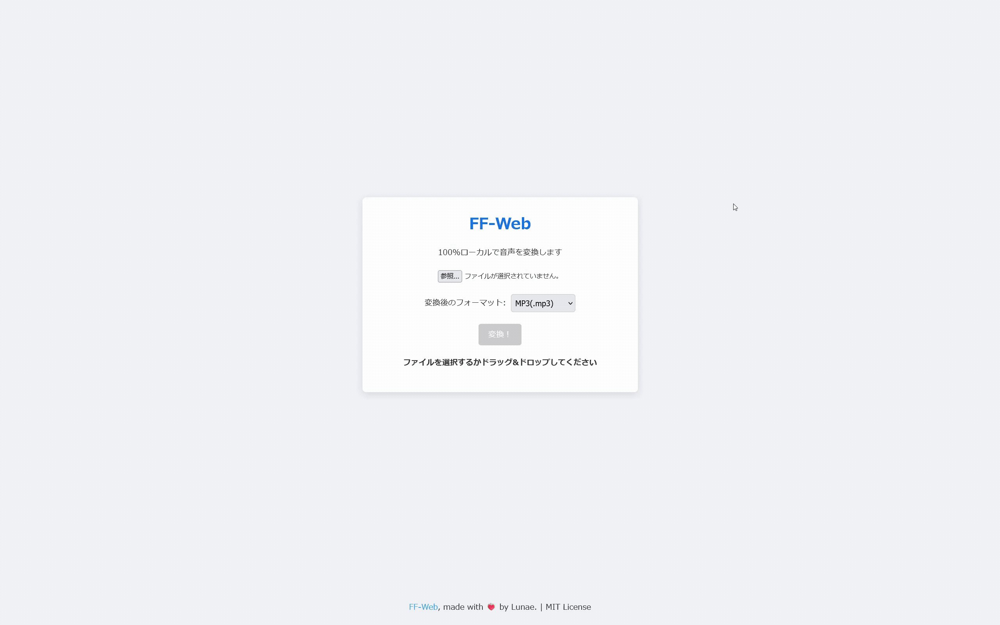

# FF-Web

<p align="center">
  
</p>

<p align="center">
  A simple, 100% browser-based audio converter.
</p>

FF-Webは、[ffmpeg.wasm](https://github.com/ffmpegwasm/ffmpeg.wasm) を利用した完全にブラウザ上で動作する音声ファイルコンバーターです。
サーバーにファイルをアップロードする必要がなく、**すべてローカルで処理**します。

## 設置

```sh
git clone https://github.com/lunae-f/FF-Web
cd FF-Web
docker compose up -d
```

---
Made with ❤️‍🔥 by Lunae.